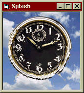



## Pond Ripples

### Description

This code demonstrates a very easy and effective way to simulate pond ripples on a picture. It will simultaneously render multiple pond ripples. Just click-drag your mouse across the image, and watch all the ripples dissipate. Very cool effect. Votes or comments are appreciated.
 
### More Info
 

             |
---                |---
**Submitted On**   |2001-06-01 11:37:18
**By**             |[Dave Andrews](https://github.com/Planet-Source-Code/PSCIndex/blob/master/ByAuthor/dave-andrews.md)
**Level**          |Advanced
**User Rating**    |4.6 (69 globes from 15 users)
**Compatibility**  |VB 5\.0
**Category**       |[Graphics](https://github.com/Planet-Source-Code/PSCIndex/blob/master/ByCategory/graphics__1-46.md)
**World**          |[Visual Basic](https://github.com/Planet-Source-Code/PSCIndex/blob/master/ByWorld/visual-basic.md)
**Archive File**   |[Pond Rippl20392612001\.zip](https://github.com/Planet-Source-Code/dave-andrews-pond-ripples__1-23679/archive/master.zip)

